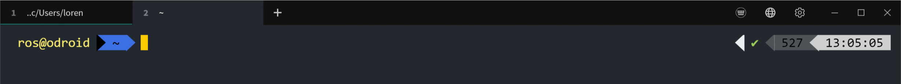
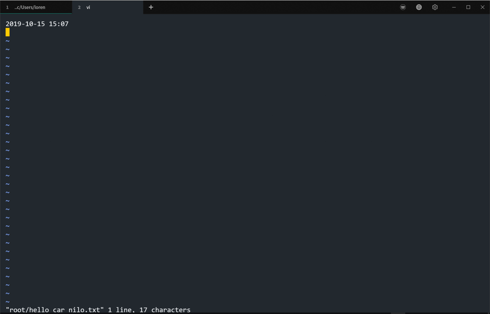
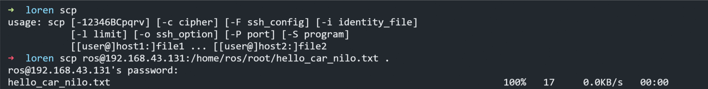
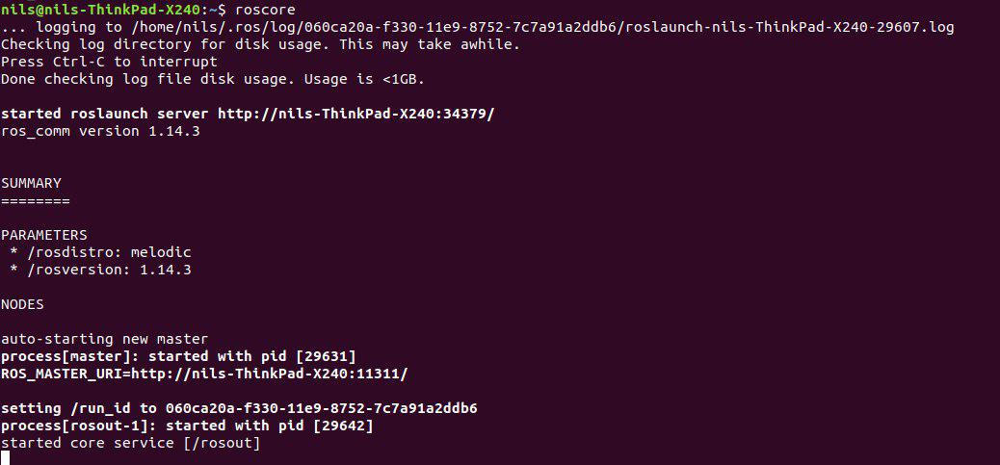

# 1. Assignment, Introduction to Robotics WS19/20

(bearbeitet von Nils Hutmacher und Lorenz Ohly)

## 1. Connect to the model car via SSH (4 Points)

SSH login:

Add text file:

scp:

## 2. Create a repository (2 Points)

[https://github.com/lorenzoh/catkin_ws_user](https://github.com/lorenzoh/catkin_ws_user)

We've sent a contributor link to github.com/goehring (hope that's the right one)

## 3. ROS installation (4 Points)

