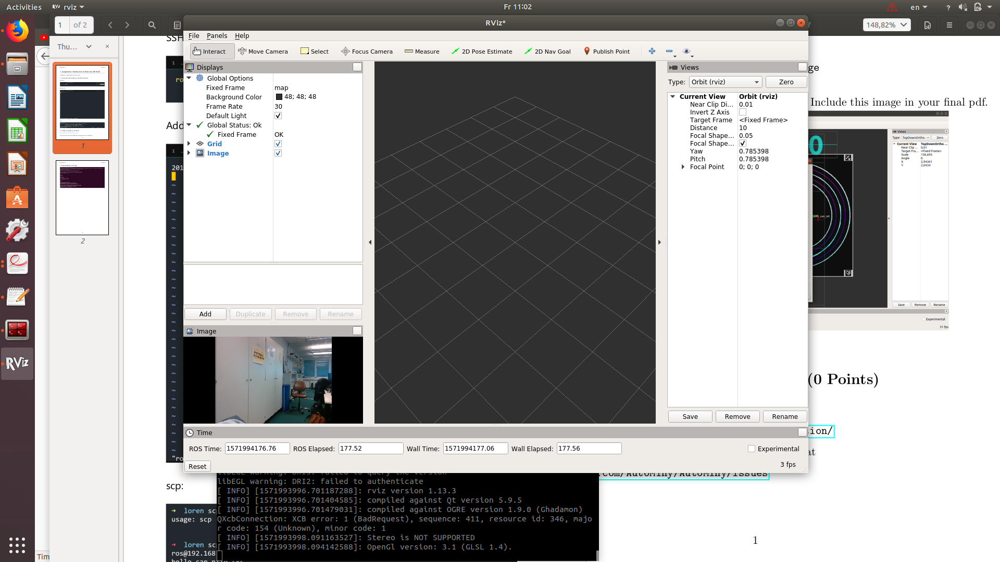
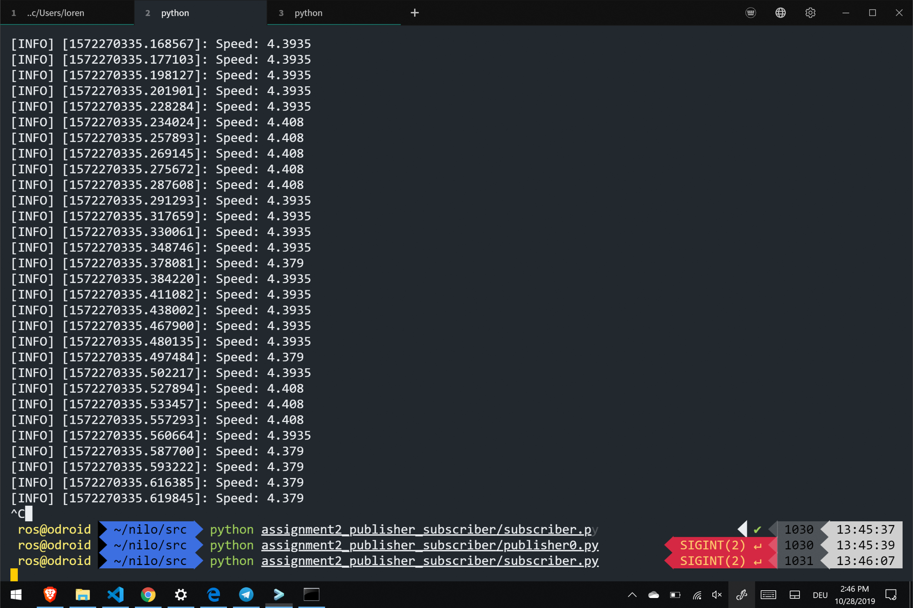

# Assignment 2
(Lorenz Ohly, Nils Hutmacher)

## Assignment 2-1: RViz (4 Points)

## Assignment 2-3: Basic Subscriber / Publisher Node (6 Points)

code see [Code](https://github.com/lorenzoh/catkin_ws_nilo/tree/master/Assignments/Assignment02/src/assignment2_publisher_subscriber)