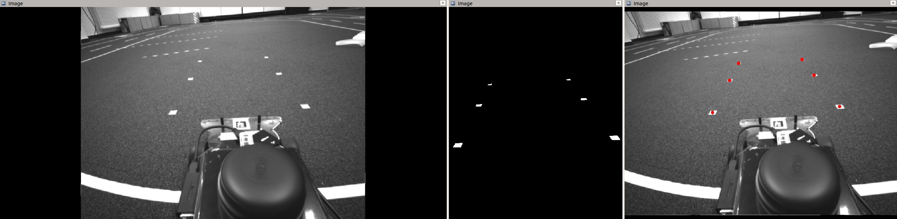
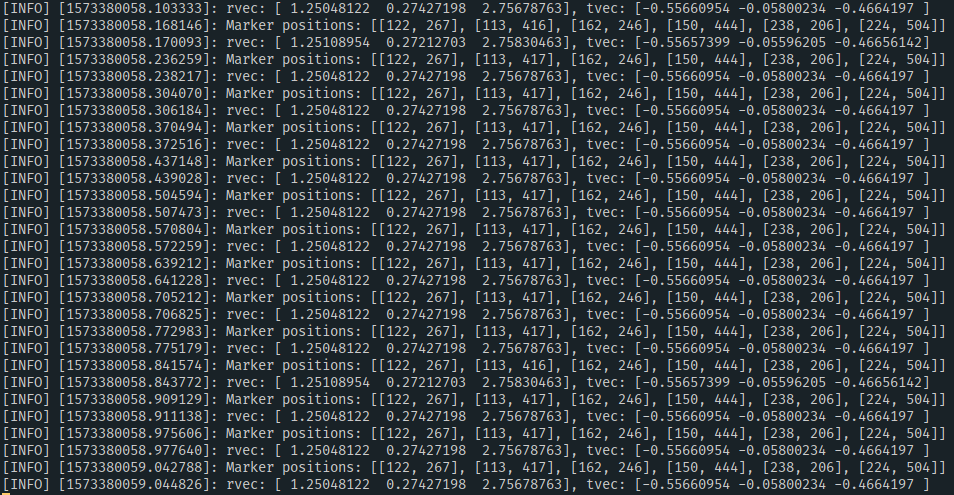

# Robotics Assignment 4 (Group nilo)

The code for this assignment can be found in [Assignment 4 on GitHub](https://github.com/lorenzoh/catkin_ws_nilo/tree/master/src/assignment4).

## Assignment 4-2: Camera parameters (1 Point)

Code for extracting the camera parameters is in `export_camera.py`

```json
{
    "fx": 383.7944641113281, "fy": 383.7944641113281,
    "cx": 322.3056945800781, "cy": 241.67051696777344,
    "k1": 0.0, "k2": 0.0, "t1": 0.0, "t2": 0.0, "k3": 0.0
}
```

## Assignment 4-3: Binary Image (2 Point)

Code for the thresholding can be foundin `find_marks.py`




## Assignment 4-4: Find white pixels (2 Points)

Code can be found in `find_marks.py`, see function `locate_marker`.

See above image for a visualization of the found points.

## Assignment 4-5: Compute the extrinsic parameters (3 Points)

Code can be found in `find_marks.py`.

Screenshot of terminal output:




## Assignment 4-6: Finding the camera pose (2 Points)

The rotation matrix computed from `Rodrigues` is:

```python
R = [[-0.65717015 -0.01834538  0.75351897]
 [ 0.16645099 -0.97855496  0.12134353]
 [ 0.73513364  0.20516733  0.64613072]]
```

Hence the homogeneous transformation matrix is: 
```
H = [R | t]
    [0 | 1]
```

Plugging in `R` and `t`, we get:

```
H = [
    [-0.657 -0.018  0.754, -0.556]
    [ 0.166 -0.979  0.121, -0.058]
    [ 0.735  0.205  0.646, -0.466]
    [ 0      0      0       1    ]
]
```

And the inverse is:

```
H_-1 =
    [-0.65701163,  0.1661405 ,  0.73573338, -0.01281056],
    [-0.01829467, -0.97827345,  0.2045902 ,  0.02842734],
    [ 0.75333429,  0.12141298,  0.64596745,  0.72691665],
    [ 0.        ,  0.        ,  0.        ,  1.        ]]
```
