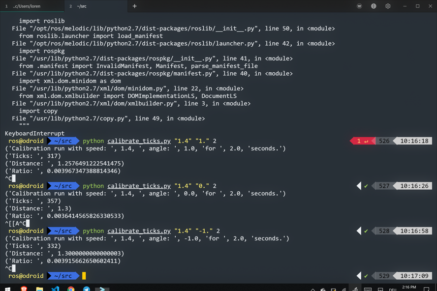

# Assignment 6

## Aufgabe 2

Da unser Auto (120) auf einen SpeedCommand von 0.2 m/s gar nicht reagiert hat, haben wir die Experimente mit einer Geschwindigkeit von 1.4 und einer Dauer von 2 Sekunden durchgeführt.

### Ergebnisse (output von [`calibrate_ticks.py`](https://github.com/lorenzoh/catkin_ws_nilo/blob/master/src/assignment6/src/calibrate_ticks.py)):

Calibration run with speed: 1.4, angle: 1.0 for 2.0 seconds:
Ticks: 317
Distance: 1.2576
Ratio: 0.0040

Calibration run with speed: 1.4, angle: 0.0 for 2.0 seconds:
Ticks: 357
Distance: 1.2577
Ratio: 0.0036

Calibration run with speed: 1.4, angle: -1.0 for 2.0 seconds:
Ticks: 332
Distance: 1.3
Ratio: 0.0039

