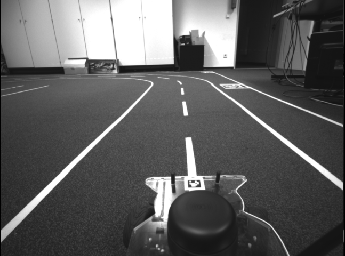
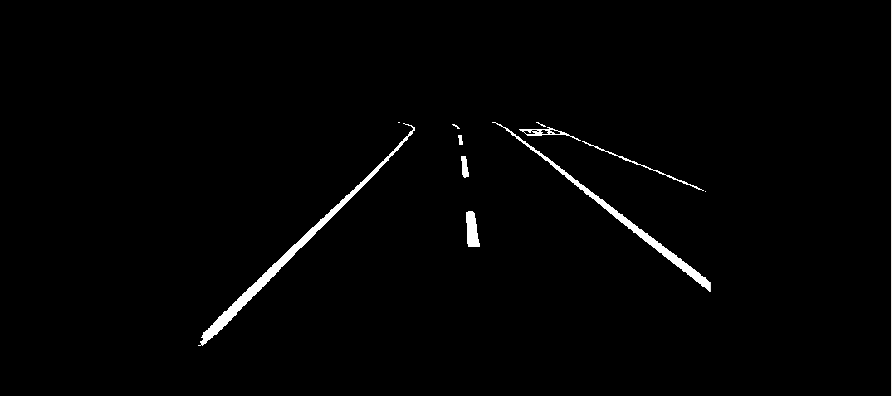
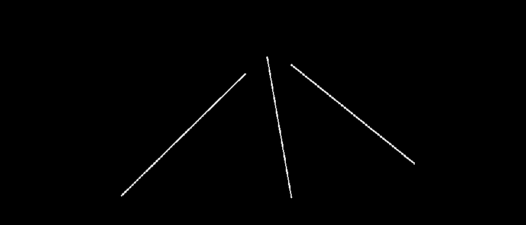

# Assignment 7

(bearbeitet von Nils Hutmacher und Lorenz Ohly)

## Assignment 7-1: Record a bagfile

Sample image as in bag file:



## Assignment 7-2: Lane segmentation (5 Points)

(code see [`segmentation_node.py`](https://github.com/lorenzoh/catkin_ws_nilo/blob/master/src/assignment7/src/segmentation_node.py))

Thresholded image:



## Assignment 7-3: Getting the line equation (5 Points)

(code see [`ransac_node.py`](https://github.com/lorenzoh/catkin_ws_nilo/blob/master/src/assignment7/src/ransac_node.py) and [`ransac.py`](https://github.com/lorenzoh/catkin_ws_nilo/blob/master/src/assignment7/src/ransac.py))

The following parameters for RANSAC were used:

- iterations: 100
- threshold for loss (must be lower to count as inlier): 400
- percentage of inliers to accept parameters: 50%

Reproduce with:

```shell
rosbag play -l infrared.bag
python segmentation_node.py
python ransac_node.py 100 400 ".5"
```

Output:

